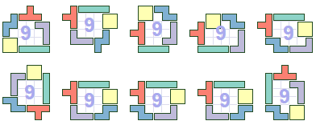
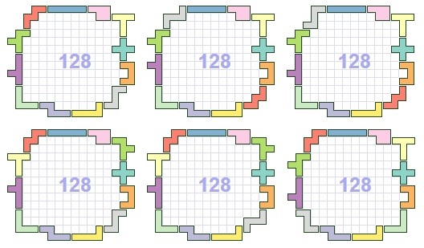
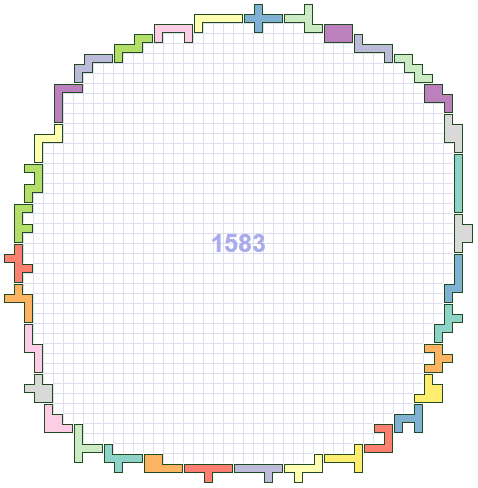

Random search solver for a "polyomino farm" problem: 

*Given a set of polyominoes, arrange them such that they enclose the largest area possible.*

Generates HTML/SVGs visualizing the results.

Example solutions for tetrominoes:

Pentominoes:

Hexominoes:

